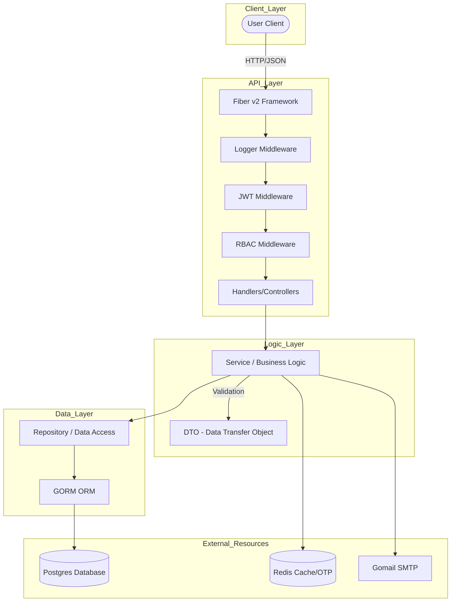
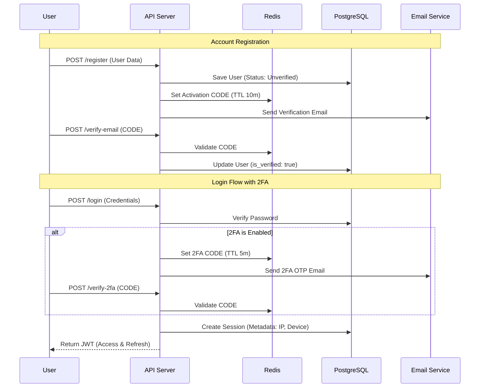

# 🛡️ Go Boilerplate - Enterprise-Ready Modular API

A robust, modular (feature-based), and production-ready REST API boilerplate using the modern Go ecosystem. Designed for scalability, security, and developer productivity.

---

## 🚀 Key Features

- **Modular Architecture**: Feature-based folder structure (Domain-Driven Design friendly).
- **Advanced Auth System**:
  - JWT Authentication (Access & Refresh Tokens).
  - RBAC (Role-Based Access Control) with granular permissions.
  - Multi-factor Authentication (2FA) & Email Verification.
  - Session Management & Device Tracking.
- **OAuth2 Integration**: Login via Google & GitHub.
- **Robust Persistence**: GORM with PostgreSQL support.
- **Caching & OTP**: Redis for fast and secure OTP validation and session tracking.
- **Embedded Email Templates**: Dynamic HTML templates using `//go:embed`.
- **Automatic Swagger**: Interactive API documentation always in sync with your code.
- **Database Migrations**: Versioned schema management using `golang-migrate`.
- **Docker Ready**: Instant deployment with Docker Compose.
- **CLI Module Generator**: Generate full CRUD boilerplate for new features with one command.

---

## 🏗️ System Architecture

This application follows a **Modular Layered Architecture**. Each module encapsulates its own logic while sharing universal components in the `shared` folder.



---

## 🔐 Auth & Security Flow



---

## 🛠️ Technology Stack

| Component | Library | Purpose |
| :--- | :--- | :--- |
| **Web Framework** | [Fiber v2](https://gofiber.io/) | High-performance (fasthttp-based) web framework. |
| **Database ORM** | [GORM](https://gorm.io/) | Object-Relational Mapping for database management. |
| **Data Persistence** | [PostgreSQL](https://www.postgresql.org/) | Robust and consistent RDBMS. |
| **Cache & OTP** | [Redis](https://redis.io/) | Fast storage for OTP codes and session tracking. |
| **Auth** | [JWT-Go (v5)](https://github.com/golang-jwt/jwt) | Industry-standard JWT tokens. |
| **Config** | [Viper](https://github.com/spf13/viper) | Dynamic configuration loading (.env, env vars). |
| **Validation** | [Validator v10](https://github.com/go-playground/validator) | Struct-based input validation. |
| **Logging** | [Logrus](https://github.com/sirupsen/logrus) | Structured logging for debugging and auditing. |
| **Migrations** | [Golang-Migrate](https://github.com/golang-migrate/migrate) | Versioned database schema management. |
| **API Docs** | [Swaggo](https://github.com/swaggo/swag) | OpenAPI/Swagger generation. |

---

## 📘 Development Guide

### 1. Generating a New Module (Recommended)
You can generate a full module with CRUD boilerplate, DTOs, and automatic route injection using the built-in generator:

```bash
# Recommended: Using Makefile
make module # then enter the name when prompted

# Or using go run directly
go run cmd/gen/main.go product
```
**This command will create:**
- `internal/modules/product/` with model, repository, service, handler, routes, and DTOs.
- Automatic registration in `cmd/api/main.go`.
- Automatic model registration for development AutoMigrate.
- **New**: Automatic `.up.sql` and `.down.sql` migration files in `db/migrations/`.

### 2. Manual Module Creation
If you prefer manual creation, follow the structure in `internal/modules/`. Ensure your module includes:
- **`model.go`**: Database entity with GORM tags.
- **`dto/`**: Request and Response structs.
- **`repository.go`**: Database access interface and implementation.
- **`service.go`**: Business logic layer.
- **`handler.go`**: HTTP request parsing and response formatting.
- **`routes.go`**: Endpoints and middleware registration.

Register the module in `cmd/api/main.go` using the generated `RegisterRoutes` function.

### 3. Database Migrations
We provide two ways to manage migrations:
- **Development**: Models are automatically synced via GORM `AutoMigrate` when `SERVER_MODE=development`.
- **Production**: Use explicit SQL migrations for safety.

**Commands:**
```bash
# Create a new migration file
make migrate-create # then type name, e.g., create_products_table

# Run all pending migrations
make migrate-up

# Rollback the last migration
make migrate-down
```

### 4. Updating Documentation
Always update Swagger docs after changing handlers or routes:
```bash
make swagger
```

---

## 🛠️ Getting Started

### Using Docker (Preferred)
```bash
# 1. Clone repository
# 2. Setup .env (copy from .env.example)
docker-compose up -d --build
```

### Manual Installation
```bash
# 1. Install dependencies
go mod download

# 2. Run migrations
make migrate-up

# 3. Generate initial Swagger
make swagger

# 4. Start the server
go run cmd/api/main.go
```

---

## 🔐 Security Features
- **Device Fingerprinting**: Every session records `IP`, `User Agent`, and `Device ID` (via `X-Device-ID` header).
- **Granular RBAC**: Use `RequireRole` or `RequirePermission` middleware to protect resources.
- **Graceful Shutdown**: Automatically closes DB and Redis connections on SIGINT/SIGTERM.

## 📄 License

This project is licensed under the MIT License - see the [LICENSE](LICENSE) file for details.

---
© 2026 Ma'sum.
