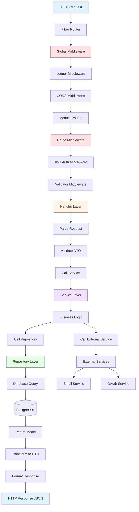
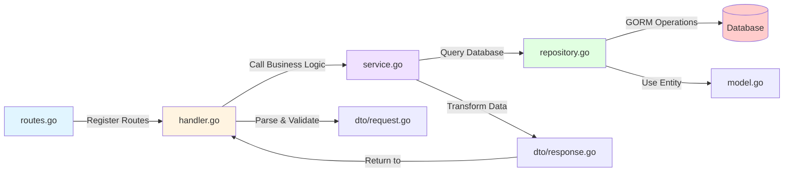
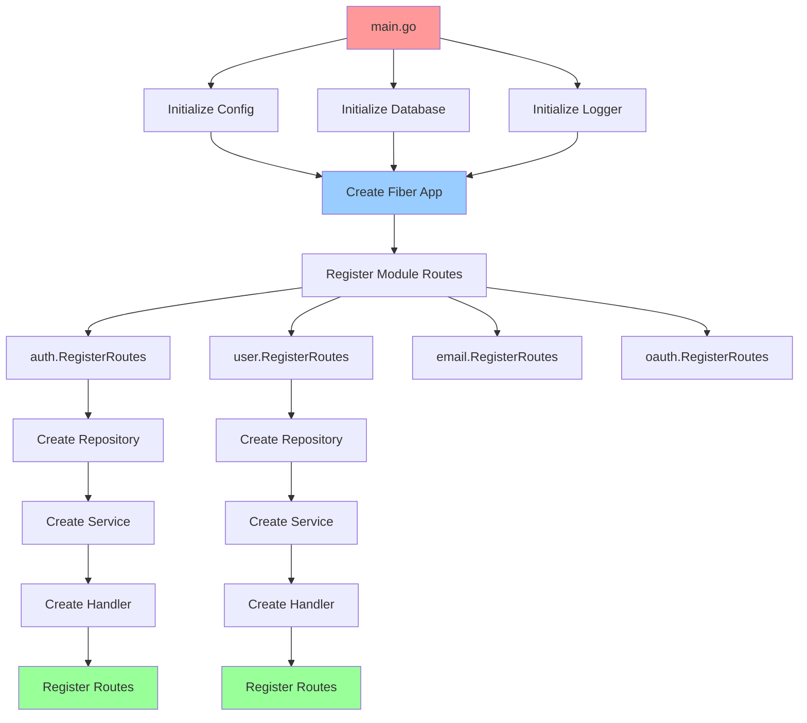
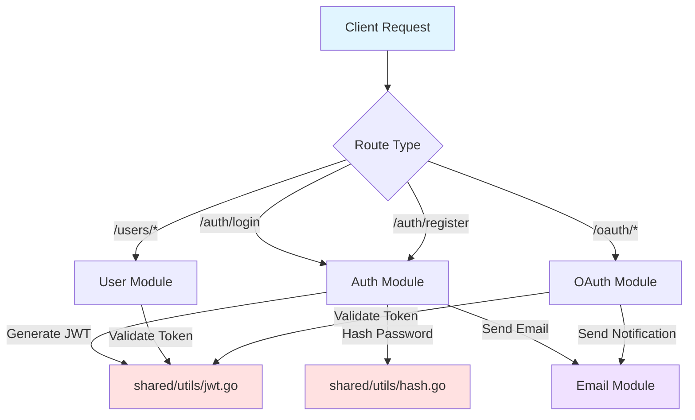
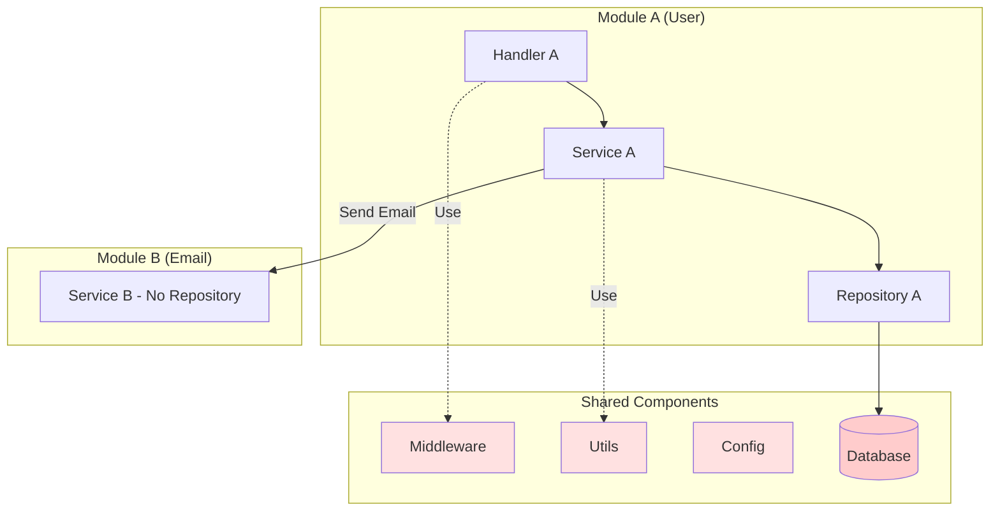
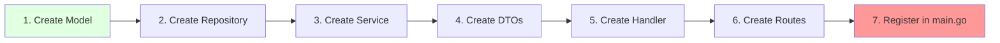

# Struktur Project Golang Modular (Feature-Based)

## 📁 Struktur Folder

```
project-root/
├── cmd/
│   └── api/
│       └── main.go                 # Entry point aplikasi
│
├── internal/
│   ├── shared/                    # 🔧 SHARED COMPONENTS
│   │   ├── config/
│   │   │   └── config.go          # Konfigurasi (Viper)
│   │   │
│   │   ├── database/
│   │   │   ├── connection.go      # Database connection (GORM + PostgreSQL)
│   │   │   └── migration.go       # Database migration & table rename
│   │   │
│   │   ├── middleware/
│   │   │   ├── auth.go            # JWT middleware + RBAC
│   │   │   ├── logger.go          # Logging middleware
│   │   │   ├── cors.go            # CORS middleware
│   │   │   └── validator.go       # Request validator middleware
│   │   │
│   │   └── utils/
│   │       ├── jwt.go             # JWT token utilities
│   │       ├── hash.go            # Password hashing (bcrypt)
│   │       ├── validator.go       # Struct validation helper
│   │       ├── response.go        # Standard API response format
│   │       └── logger.go          # Logger setup & helper
│   │
│   └── modules/                   # 🔥 FEATURE MODULES
│       │
│       ├── auth/                  # AUTH MODULE
│       │   ├── model.go           # Auth-related models (jika ada)
│       │   ├── repository.go      # Auth data access
│       │   ├── service.go         # Auth business logic
│       │   ├── handler.go         # Auth HTTP handlers
│       │   ├── routes.go          # Auth route registration
│       │   └── dto/
│       │       ├── request.go     # Login, Register, Refresh DTOs
│       │       └── response.go    # Token response DTOs
│       │
│       ├── user/                  # USER MODULE
│       │   ├── model.go           # User entity/model
│       │   ├── repository.go      # User repository (CRUD)
│       │   ├── service.go         # User business logic
│       │   ├── handler.go         # User HTTP handlers
│       │   ├── routes.go          # User route registration
│       │   └── dto/
│       │       ├── request.go     # Create, Update user DTOs
│       │       └── response.go    # User response DTOs
│       │
│       ├── role/                  # ROLE MODULE (RBAC)
│       │   ├── model.go           # Role entity/model
│       │   ├── repository.go      # Role repository
│       │   ├── service.go         # Role business logic + seeding
│       │   ├── handler.go         # Role HTTP handlers
│       │   ├── routes.go          # Role route registration
│       │   └── dto/
│       │       ├── request.go     # Create, Update role DTOs
│       │       └── response.go    # Role response DTOs
│       │
│       ├── email/                 # EMAIL MODULE
│       │   ├── service.go         # Email service (gomail)
│       │   ├── template.go        # Email HTML templates
│       │   └── dto/
│       │       └── request.go     # Email send request DTO
│       │
│       └── oauth/                 # OAUTH MODULE
│           ├── service.go         # OAuth2 service (Google, GitHub)
│           ├── handler.go         # OAuth callback handlers
│           ├── routes.go          # OAuth routes
│           └── dto/
│               └── response.go    # OAuth user info response
│
├── docs/
│   ├── docs.go                    # Swagger generated files
│   ├── swagger.json
│   └── swagger.yaml
│
├── pkg/
│   └── ...                        # Public packages (optional)
│
├── .env.example
├── .gitignore
├── go.mod
├── go.sum
├── Makefile
└── README.md
```

---

## 🏗️ Pattern & Responsibility

### **`cmd/api/main.go`**
- Initialize shared components (config, database, logger)
- Register all module routes
- Start Fiber server

### **`internal/shared/`** - Shared Components

#### `config/`
- Load configuration dari environment variables
- Menggunakan Viper
- Config struct untuk type-safe access

#### `database/`
- Database connection pooling (GORM + PostgreSQL)
- Auto migration
- Connection management

#### `middleware/`
- **auth.go**: JWT validation middleware
- **logger.go**: HTTP request/response logging
- **cors.go**: CORS configuration
- **validator.go**: Request body validation

#### `utils/`
- **jwt.go**: Generate & validate JWT tokens
- **hash.go**: Password hashing dengan bcrypt
- **validator.go**: Struct validation helper
- **response.go**: Standardized JSON response
- **logger.go**: Logrus configuration

---

### **`internal/modules/`** - Feature Modules

#### Standard Module Structure
Setiap module mengikuti pattern yang sama:

```
module-name/
├── model.go           # Domain entity (GORM model)
├── repository.go      # Data access layer (database operations)
├── service.go         # Business logic layer
├── handler.go         # HTTP request handlers (controller)
├── routes.go          # Route registration & middleware setup
└── dto/
    ├── request.go     # Input validation DTOs
    └── response.go    # Output DTOs
```

#### Layer Responsibilities

**`model.go`**
- Define database entity/schema
- GORM struct tags
- Table relationships
- Hooks (BeforeCreate, AfterUpdate, etc)

**`repository.go`**
- Interface definition
- CRUD operations
- Database queries
- No business logic

**`service.go`**
- Interface definition
- Business logic implementation
- Orchestrate multiple repositories
- Call external services
- Data transformation

**`handler.go`**
- Parse HTTP request
- Validate input (call validator)
- Call service methods
- Format & return HTTP response
- Error handling

**`routes.go`**
- Register routes untuk module
- Apply middleware (auth, validator, etc)
- Group related endpoints
- Dependency injection dari main.go

**`dto/request.go`**
- Input validation structs
- Validation tags (required, email, min, max, etc)
- Request body parsing

**`dto/response.go`**
- Output format structs
- Hide sensitive fields (password, dll)
- Consistent response structure

---

## 🔄 Request Flow Diagram



---

## 🔀 Module Internal Flow



---

## 🔌 Dependency Injection Flow



---

## 📊 Module Interaction Flow



---

## 🎯 Layer Communication Pattern



---

## 📋 Naming Convention

### Files
- **model.go** - Singular noun (User, Product, Order)
- **repository.go** - Data access methods
- **service.go** - Business logic methods
- **handler.go** - HTTP handlers
- **routes.go** - Route registration

### Interfaces & Structs
- **Interface**: `UserRepository`, `UserService`
- **Implementation**: `userRepository`, `userService` (private)
- **Constructor**: `NewRepository()`, `NewService()`, `NewHandler()`

### Methods
- **Repository**: `Create`, `FindByID`, `Update`, `Delete`, `FindAll`
- **Service**: Business-specific names (`GetUserProfile`, `CreateOrder`, `ProcessPayment`)
- **Handler**: HTTP verb-like names (`GetUser`, `CreateUser`, `UpdateUser`, `DeleteUser`)

---

## 🚀 Module Development Workflow



---

## ✨ Keuntungan Pattern Ini

### 1. **Clear Separation of Concerns**
- Shared components terpisah dari module-specific code
- Setiap layer punya tanggung jawab jelas

### 2. **Scalability**
- Tambah module baru tanpa ganggu existing code
- Module independen satu sama lain

### 3. **Maintainability**
- Mudah cari kode (semua tentang User ada di `modules/user/`)
- Perubahan di satu module tidak affect module lain

### 4. **Testability**
- Mudah mock dependencies per layer
- Test isolated per module

### 5. **Team Collaboration**
- Developer bisa kerja di module berbeda
- Minimal merge conflicts

### 6. **Reusability**
- Shared utils bisa dipakai semua module
- No code duplication

---

## 📦 Example Module List

```
internal/
├── shared/              # Komponen global
│   ├── config/
│   ├── database/
│   ├── middleware/
│   └── utils/
│
└── modules/             # Feature modules
    ├── auth/            # Authentication & authorization
    ├── user/            # User management
    ├── role/            # Role & permission management (RBAC)
    ├── email/           # Email notifications
    └── oauth/           # Social login
```

---

## 🔧 Quick Start: Add New Module

```bash
# Create module structure
mkdir -p internal/modules/payment/dto
cd internal/modules/payment

# Create files
touch model.go repository.go service.go handler.go routes.go
touch dto/request.go dto/response.go
```

Implement pattern yang sama seperti module lain, lalu register di `main.go`!

---

## 📚 Technology Stack

- **Framework**: Fiber v2
- **ORM**: GORM + PostgreSQL Driver
- **Validation**: go-playground/validator/v10
- **JWT**: golang-jwt/jwt/v5 + gofiber/contrib/jwt
- **JSON**: bytedance/sonic (fast serialization)
- **Config**: spf13/viper
- **Logger**: sirupsen/logrus
- **Email**: gopkg.in/gomail.v2
- **OAuth**: golang.org/x/oauth2
- **Docs**: swaggo/swag + gofiber/swagger
- **Testing**: stretchr/testify

---

## 🔐 RBAC System (Role-Based Access Control)

### Overview

API ini menggunakan sistem RBAC yang komprehensif dengan:
- **3 Default Role**: SuperAdmin, Admin, User
- **Granular Permissions**: Format `resource.action` (contoh: `users.create`, `roles.delete`)
- **Wildcard Permission**: `*` memberikan akses penuh (hanya SuperAdmin)
- **Penyimpanan Role**: Tabel terpisah `m_roles` dengan foreign key ke `m_users`
- **Stateless Auth**: Data role dan permission disematkan dalam JWT tokens
- **JSONB Storage**: Permissions disimpan sebagai tipe JSONB di PostgreSQL untuk query yang efisien

### Default Roles & Permissions

**SuperAdmin** (`slug: super_admin`)
- Permissions: `["*"]` (akses penuh ke semua)
- Bisa: Kelola semua resource, assign role, kelola role

**Admin** (`slug: admin`)
- Permissions: `["users.create", "users.read", "users.update", "users.delete", "roles.read", "roles.assign"]`
- Bisa: Create/read/update/delete users, read roles, assign roles ke users
- Tidak bisa: Kelola roles (create/update/delete roles)

**User** (`slug: user`)
- Permissions: `["users.read", "users.update"]` (hanya profil sendiri)
- Bisa: Read dan update profil sendiri
- Tidak bisa: Akses user lain, kelola roles, operasi admin

### Role Assignment Rules

API ini menerapkan aturan assignment role yang ketat untuk keamanan:

**Registrasi (POST /api/v1/auth/register):**
- Otomatis assign role "user"
- Tidak bisa specify role saat registrasi
- Semua user baru mulai dengan permission "user" dasar

**Create User (POST /api/v1/users) - Hanya Admin/SuperAdmin:**
- Bisa optional specify `role_id` di request body
- Hanya boleh membuat user dengan role "user" atau "admin"
- TIDAK bisa membuat user dengan role "super_admin" via endpoint ini
- Jika `role_id` tidak diisi, default ke role "user"
- Contoh: `{"name": "Budi", "email": "budi@example.com", "password": "pass123", "role_id": "uuid-here"}`

**Update User (PUT /api/v1/users/:id):**
- Admin/SuperAdmin bisa update field `role_id`
- Hanya boleh update role ke "user" atau "admin"
- User biasa TIDAK bisa update role mereka sendiri (diblock di handler level)
- Non-admin user hanya bisa update name dan email mereka sendiri

**Assign Role (PUT /api/v1/users/:id/role) - Hanya SuperAdmin:**
- Bisa assign role apapun termasuk "super_admin"
- Ini SATU-SATUNYA cara untuk memberikan role super_admin ke user
- Memerlukan role UUID di request body

**Tabel Ringkasan:**

| Endpoint | Access Level | Bisa Assign "user"? | Bisa Assign "admin"? | Bisa Assign "super_admin"? |
|----------|--------------|-------------------|---------------------|---------------------------|
| **POST /api/v1/auth/register** | Public | ✅ (auto) | ❌ | ❌ |
| **POST /api/v1/users** | Admin/SuperAdmin | ✅ (default) | ✅ (optional) | ❌ (blocked) |
| **PUT /api/v1/users/:id** | All users* | ✅ (admin only) | ✅ (admin only) | ❌ (blocked) |
| **PUT /api/v1/users/:id/role** | SuperAdmin only | ✅ | ✅ | ✅ |

*User biasa bisa update profil mereka sendiri tapi TIDAK bisa update role mereka. Hanya Admin/SuperAdmin yang bisa update role.

### Menggunakan RBAC Middleware

**RequireRole - Lindungi route berdasarkan role:**
```go
// Hanya SuperAdmin yang bisa akses
protected.Use(middleware.RequireRole(cfg, "super_admin"))

// Admin atau SuperAdmin bisa akses
protected.Use(middleware.RequireRole(cfg, "admin", "super_admin"))
```

**RequirePermission - Lindungi route berdasarkan permission:**
```go
// Hanya user dengan permission users.create yang bisa akses
protected.Use(middleware.RequirePermission(cfg, "users.create"))
```

### Protected Routes Summary

**Public Routes:**
- `/api/v1/auth/register` - Registrasi user
- `/api/v1/auth/login` - Login user
- `/api/v1/auth/refresh` - Refresh token
- `/api/v1/oauth/*` - Redirect dan callback OAuth

**Authenticated Routes (Semua User):**
- `/api/v1/users/me` - Get/update profil sendiri
- `/api/v1/users/:id` (PUT) - Update user (sendiri atau admin)

**Admin/SuperAdmin Routes:**
- `/api/v1/users` (GET) - List semua users
- `/api/v1/users` (POST) - Create user
- `/api/v1/users/:id` (DELETE) - Delete user
- `/api/v1/roles` (GET) - List semua roles

**SuperAdmin Only Routes:**
- `/api/v1/users/:id/role` (PUT) - Assign role ke user
- `/api/v1/roles` (POST) - Create role
- `/api/v1/roles/:id` (PUT/DELETE) - Update/delete role

### SuperAdmin Account

Aplikasi otomatis membuat/mengupdate akun SuperAdmin default saat startup menggunakan kredensial dari `.env`:
- Jika akun belum ada, akun akan dibuat
- Jika akun sudah ada, password dan detail akan diupdate dari config `.env`
- Selalu di-assign role "super_admin" dengan permission penuh `["*"]`
- **Penting**: Ganti password default setelah first login di production!

**Environment Variables untuk SuperAdmin:**
- `SUPERADMIN_NAME` - Nama akun SuperAdmin (default: "Super Admin")
- `SUPERADMIN_EMAIL` - Email SuperAdmin (default: "superadmin@boilerplate.com")
- `SUPERADMIN_PASSWORD` - Password SuperAdmin (default: "SuperAdmin123!")

---

## 🗄️ Database Table Naming Convention

Tabel menggunakan prefix untuk menandai tipenya:

**Master Tables** (prefix `m_`):
- `m_users` - Akun user
- `m_roles` - Definisi role

**Transaction Tables** (prefix `t_`):
- `t_refresh_tokens` - Refresh token JWT
- `t_oauth_accounts` - Link provider OAuth

**Migration Strategy:**
- Di mode development, tabel lama (`users`, `oauth_accounts`, `refresh_tokens`) di-drop saat startup
- Tabel baru dengan prefix dibuat otomatis via GORM AutoMigrate
- Dikontrol oleh fungsi `RenameTables()` di `internal/shared/database/migration.go`
- Hanya jalan saat `SERVER_MODE=development`

---

## 🎛️ Feature Flags

Fitur opsional bisa di-enable/disable via environment variables:

- **OAUTH_GOOGLE_ENABLED**: Enable/disable Google OAuth (default: false)
- **OAUTH_GOOGLE_SEND_WELCOME_EMAIL**: Kirim welcome email setelah Google OAuth (default: false)
- **OAUTH_GITHUB_ENABLED**: Enable/disable GitHub OAuth (default: false)
- **OAUTH_GITHUB_SEND_WELCOME_EMAIL**: Kirim welcome email setelah GitHub OAuth (default: false)
- **EMAIL_ENABLED**: Master switch untuk fungsi email (default: false)
